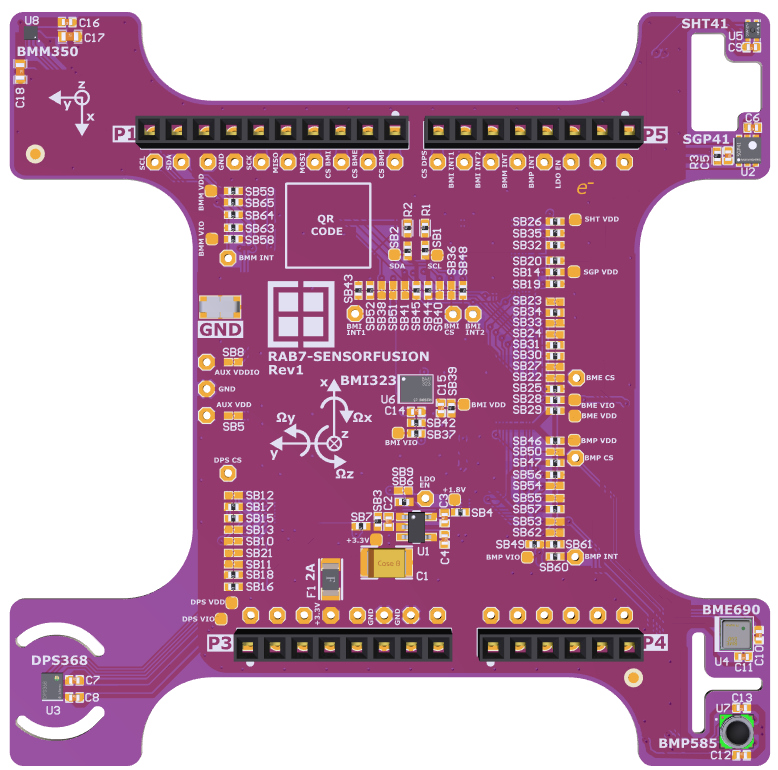

# RAB7-SENSORFUSION Hardware Design Files

RAB7-SENSORFUSION is an Arduino shield adapter board for the environment and inertial sensors from Infineon, Sensirion and Bosch evaluation and prototyping.

Here you may find hardware documents as follows:

- Schematics, PCB layout, and mechanical drawings
- BOM: Bill of Materials
- Assembly drawings
- Altium Designer Project
- Gerber Files

## Legal Disclaimer

The evaluation board including the software is for testing purposes only and, because it has limited functions and limited resilience, is not suitable for permanent use under real conditions. If the evaluation board is nevertheless used under real conditions, this is done at one’s responsibility; any liability of Rutronik is insofar excluded. 

